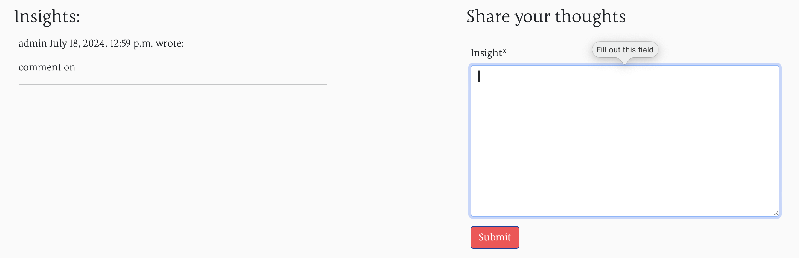
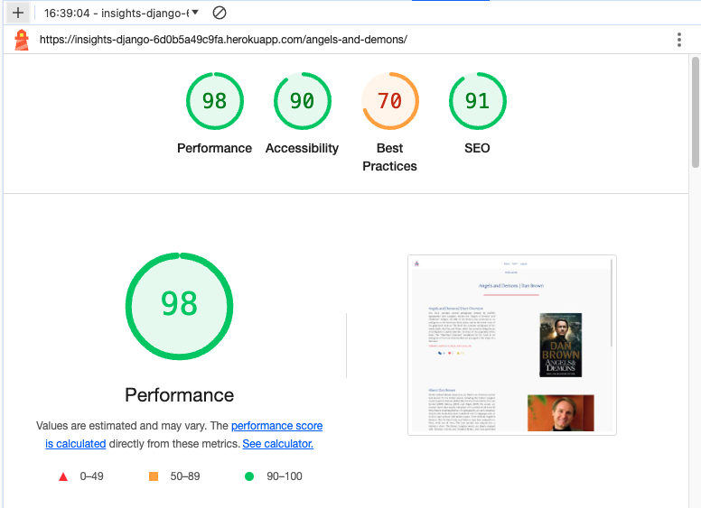

# Insights

Insights is a website which provides reviews about a book or books which the user has read. Clients will be able to have a review of many books to help them taking a decision on whether it is worth buying this book or not.

Insights makes use of the knowledge gained up till know to code a full website using a bunch of technologies varying from front end to the back end. Besides it applies the Model View Controller (MVC) design pattern to offer not a static website but rather an interactive webpage.

Insights starts by introducing itself as a platform for books, people can look for when they are logged in and enjoy reading a short description about the book as well as its author. Clients who are registered can also give their thought and reviews about books they have read before and they can also add a new book with its author. New books suggestions should be first approved by the admin of the page before they are public to the audience. 

Rating of a book, likes of a books as well as reviews on a specific book will be very helpful to guide any client whether to read this book or move to something else. Books are classified based on their categories which might by useful when filtering and narrowing the choice.


  


## Live Site
🚨**Required** 

- Your can visit my website [Insights](https://insights-django-6d0b5a49c9fa.herokuapp.com) .

## Repository
🚨**Required** 

- A complete documentation on gitHub on [Insights](https://github.com/AlAliMazen/Insights) .

## Author
🚨**Required** 

Mazen Al Ali

- [Insights](#insights)
  * [Live Site](#live-site)
  * [Repository](#repository)
  * [Author](#author)
- [Table of Contents](#table-of-contents)
- [UX](#ux)
  * [Target Audience](#target-audience)
  * [Design Choices](#design-choices)
    + [Colors](#colors)
    + [Typography](#typography)
    + [Images](#images)
    + [Design Elements](#design-elements)
    + [Hover Effects and Icons](#hover-effects-and-icons)
    + [Frameworks](#frameworks)
    + [Custom Styles](#custom-styles)
    + [Custom Javascript](#custom-javascript)
  * [Wireframes](#wireframes)
- [Information Architecture [DONE]](#information-architecture--done-)
  * [Entity Relationship Diagram](#entity-relationship-diagram)
  * [Database Choice [DONE]](#database-choice--done-)
  * [Data Models [DONE]](#data-models--done-)
  * [CRUD Diagrams  [DONE]](#crud-diagrams---done-)
    + [Review Model:](#review-model-)
    + [Adding Author, Category or Book:](#adding-author--category-or-book-)
    + [Likes and Rating Models:](#likes-and-rating-models-)
- [Agile Process  [DONE]](#agile-process---done-)
  * [Project Goals](#project-goals)
  * [Initial User Stories  [DONE]](#initial-user-stories---done-)
  * [Scope](#scope)
  * [Agile Tool](#agile-tool)
    + [User Story Example](#user-story-example)
- [Features  [DONE]](#features---done-)
  * [Implemented Features](#implemented-features)
  * [Future Features](#future-features)
  * [Testing](#testing)
  * [Manual Testing](#manual-testing)
  * [Compatibility and Responsive Testing](#compatibility-and-responsive-testing)
    + [Why Choosing the pre-defined Browsers](#why-choosing-the-pre-defined-browsers)
  * [Accessibility Testing](#accessibility-testing)
  * [Validation Testing](#validation-testing)
    + [HTML Validation](#html-validation)
    + [CSS Validation](#css-validation)
    + [JavaScript Validation](#javascript-validation)
    + [Python Validation](#python-validation)
  * [Defects](#defects)
  * [Defects of Note](#defects-of-note)
  * [Outstanding Defects](#outstanding-defects)
- [Technologies Used](#technologies-used)
  * [Languages](#languages)
    + [Frontend](#frontend)
    + [Backend](#backend)
  * [Frameworks, Libraries & Programs Used](#frameworks--libraries---programs-used)
- [Deployment](#deployment)
  * [Prerequisites](#prerequisites)
  * [Fork and Clone the Repository](#fork-and-clone-the-repository)
  * [Local Development Deployment](#local-development-deployment)
  * [Production Deployment](#production-deployment)
- [Credits](#credits)
  * [Repo on GitHub Template](#repo-on-github-template)
  * [Content](#content)
  * [Media](#media)
  * [Acknowledgments](#acknowledgments)

<small><i><a href='http://ecotrust-canada.github.io/markdown-toc/'>Table of contents generated with markdown-toc</a></i></small>


# UX
🚨**Required** 

## Target Audience
🚀 **merit & beyond**

Based on the the first idea in my mind, I have coded this website with intention to target the following group of people:

- **Book Enthusiasts** : for all thise who are passionate about reading and want to share their love for books.

- **(Avid) Readers**: For individuals who are always on the lookout for new books to devour and enjoy reading reviews before making a choice.

- **Literary Critics**: For people who enjoy analyzing literature and wish to share their perspectives with a broader audience.

## Design Choices
🚀 **merit & beyond**

Now that you have let the assessors know about the target audience and users, you can go into the design choices

### Colors
🚀 **merit & beyond**

For my colors I have used the following three colors which can make a high contrast helping for reading on a whit background
 - Dark Blue : RGB(10,65,159) -> HEX: #0A419F 
 - Dark RED : RGB(255,75,80) -> HEX: #FF4B50 
 - Light Blue: RGB(63,89,143) -> HEX: #3F598F
 
 For the font and the background, I have used the following standard colors:
 - Background: RGB(250,250,250) -> HEX: #FAFAFA
 - Font Color: RBB(0,0,0)       -> HEX:  #000000


### Typography
🚀 **merit & beyond**

As this is a website about giving reviews about books which are mostly printable, I have used a similar font which is also for printing. I have used Google fonts and specifically the one used here is called **Junge** 

For the [see the Junge Font Family](https://fonts.google.com/specimen/Junge?query=junge) .


### Images
🚀 **merit & beyond**

I have depended heavily on [Unsplash website for free images](https://unsplash.com/) .

Images used on this website are listed below:
- [Scattered books](https://unsplash.com/photos/white-and-blue-printer-paper-mo3FOTG62ao) .

- [Women standing before book shelf](https://unsplash.com/photos/woman-finding-some-book-to-read-mbKApJz6RSU)

- [Old book with pen and Camera](https://unsplash.com/photos/flat-ray-photography-of-book-pencil-camera-and-with-lens-3OiYMgDKJ6k).

- [books in shelf](https://unsplash.com/photos/assorted-title-of-books-piled-in-the-shelves-NIJuEQw0RKg).

- [Thinking Fast and Slow](https://unsplash.com/photos/the-new-york-times-book-kshkB1i5_5o).

- [Scattered books II](https://unsplash.com/photos/a-pile-of-books-sitting-next-to-each-other-Hqbkgga0rNQ)

- [books above each other](https://unsplash.com/photos/pile-of-assorted-title-books-xY55bL5mZAM).

- [Placeholder book](https://unsplash.com/photos/white-printer-paper-on-white-surface-zx2xVvxBcww).

- 

- 


### Design Elements
🚀 **merit & beyond**

- For styling my website I have depend depend on the [Code Institute template](https://github.com/Code-Institute-Solutions/blog/tree/main/01_getting_set_up) as a base template and then customize it based on my needs using **Bootstrap5** built in classes. 


### Hover Effects and Icons
🚀 **merit & beyond**

- When moving cursor over a menubar link a hover effect is going to take place. This hove effect is called **underline from center** . I bring the CDN link for the Hover effect from the [CDN for Hover Effects](https://cdnjs.com/libraries/hover.css)

A list of the available Hover effects can be found under this link [Hover Effects to choose from](https://ianlunn.github.io/Hover/)


- Another vital element used heavily on this website is the use of Font-awesome icons which are very helpful indicating the purpose they are created for:

1- [Indicating Reviews on A book ](https://fontawesome.com/icons/comments?f=classic&s=solid)

2- [Rating a book ](https://fontawesome.com/icons/star?f=classic&s=solid)

3 - [Likes on a book ](https://fontawesome.com/icons/heart?f=classic&s=solid)

4- [Linked In ](https://fontawesome.com/icons/linkedin?f=brands&s=solid)

5 - [GitHib Icon](https://fontawesome.com/icons/github?f=brands&s=solid)


### Frameworks
🚨**Required** 

For making the website as responsive as possible I do have used Bootstrap5 and read through its documentation as following :

 - For the Landing page carousel I have used [three images with text below](https://getbootstrap.com/docs/5.3/components/carousel/)

 - For showing off the books gallery on landing page, I have used a [card page](https://getbootstrap.com/docs/5.3/components/card/)

 -  [Navigation bar](https://getbootstrap.com/docs/5.3/components/navbar/) is made of a logo to the left, menubar in the middle. When Website is being loaded on a mobile devices, the menubar is going to be squeezed into a burger button located to the upper right corner of the page.

### Custom Styles
🚨**Required**

- In order to customize the website, I have coded my own CSS file located in under [project  static root directory](https://github.com/AlAliMazen/Insights/tree/main/static/css) in the template/css/style.css


### Custom Javascript
🚨**Required** 

- call attention to any custom javascript you created to help your User Experience you can organize this by functions or files

## Wireframes
🚨**Required** 

I have used [Balsamiq-Wireframes](https://balsamiq.com/wireframes/) application to create the wireframes which I have coded as frontend view. Client is expected to land on the Home page as in the following screenshot:


Visitors are presented with a landing page which is made of a central navigation where user can choose to **add an author, category or a book**. Visitors can also register and get an account. It is also indicating the visitors who don't still have an account, they will have a red label under the navigation indicating that they are still not registered. Though, they can scroll down to see the carousal made of three slides offering same functionality as for Add menu-bar item. Scrolling down will also show visitors who are still not registered the list of available and approved books with their cover image, author, title, category and by whom it was added and when. Books'gallery is made up of two rows, three book each. In case there are more than 6 books, the next button will be shown under the book's gallery indicating that there are other books available. Clicking on any book title will take the visitor to the selected book details page as following 


On Book Insight page visitors are presented with more information on the book as well as its author. This page is made up of 3 big rows and two columns in each. It starts with the book short over view, what the book is about and it genre. It provides information about the one who added this book and when. It shows the number of approved reviews, likes and rating. In the second section, it sheds light on the author of the book who is also very important and can write many different books. Authors can also be added by a different user as the one who added the book. Last but not least, if the visitor is already logged in and has got an account, s/he can write a review on one of the books available, **edit his own review** or even **delete** it. Furthermore, logged in visitors can **put a like** on the book and it will be added at real time. Also s/he can rate the book. It is worth mentioning that both Likes and Rating are only available once meaning that if the logged in visitor has liked the book before, s/he can't like the book one more time. This is going to be a future feature to update the value in the database. When User submits his review, it will be shown right away as faded text awaiting for approval by the website admin on the backend. When User tries to delete his own review a confirmation model is going to be shown to ask user whether he is sure about what is going to happen and indicating that the action can't be undone afterwards.

Moving to the next part of the website is where visitors need to register, Clicking on the **Register** in the navigation will lead to the following sign-up page


Visitors are required only to provide a username and a password but not an email. It is however required to be a valid email address if user provides only some letter which can't be validated by Django to be a legitimate email address. After successful sign-up process, users will be redirected back to the **Home** page where the can now add sources to the website and not only writing a review to a book.

- Logged in user can choose **Add** from navigation or from the 3-home-slide to add an author where they will be directed to another page called add-author. Authors don't need to be approved by the admin to be made available for other users. User must provide information about the author like full name, birth, place of birth and author's photo as well as a short biography about him. If any information in the form is not correct Django will indicate it and won't submit the information to the backend for storing in the database. On the other hand, if provided information are correct and valid, there will be a modal showing success message confirming that the added author has be saved to the database.


- Moving to the adding Category is nearly the same as the one for the adding author, except that it requires only two pieces of information i.e. name of category and description for the category. In case these information are valid, there will be a confirmation modal assuring the user that the category has been saved to the database. Categories don't require to be approved by the admin to be shown for books later on. Page for adding a new category looks like the following wireframe 


- Last but not least is the **adding Books** page where logged in user must also provide title of the book, select the author from the drop-down menu, provide a short overview on the book and categorize the book under one of the available categories. An image for the book cover must also be provided, other wise a placeholder image is going to be shown later one. **Books need to be approved by the website admin in order to be shown on the landing page**. A success confirmation message inside a modal is going to be shown when storing a new book has been conducted successfully.


User can also sign-out when if he is not using his own device and he will be asked it he is sure about signing out as in the following wireframe


🚀 **merit & beyond** STILL NOT DONE
- tablet views
- Custom 404
- Profile Page
- Login
- Register
- Forgot Password


# Information Architecture [DONE]
🚨**Required** 

## Entity Relationship Diagram
🚨**Required** 

For designing and planning my Entities (Models) which are reflected in the database for this project I have used [Quick DBD Online Tool](https://www.quickdatabasediagrams.com/) in the basic plan.


## Database Choice [DONE]
🚨**Required** 

I have used PostgreSQL indicated and recommended by Code Institute. First I have set up a database connection using the CI recommendations and link it int he Project env.py as DATABASE_URL. It is not possible to check this file as it is added in the .gitignore for security reasons. 

## Data Models [DONE]
🚨**Required** 


The Database is made of the following entities (Tables):

1- Author : can be added by a created by user or Admin. Client can add many authors even if they still didn't have red their books. **One** authors can write **One or Many** book/s. Admin on the backend can approve the client author and make it available in the dropdown page for other clients.

Author Entity has the following Columns:


2- Category : can be added by a created by user or Admin. Clients can add new Category which is not included in the dropdown list in order to categorize the book later on. This Model has Many-to-One relationship to Book entity. Many books can be categorized under one category. The entity is quiet simple and it has a only two columns in addition to its ID. These Columns are category name and category description. It is supposed to be used for future purposes.

Category table has the following structure:


3- Book : This is the main entity used across website. Books can be added. This table makes use of Author, Category, User, Review, Likes and Rating table. Thus, its relation as as following based on other entities:

  - Many-to-One  : With Author table
  - Many-to-One  : With User who added the book
  - Many-to-One  : with Category as many books can be categorized under one genre
  - One-to-Many  : with Reviews because one book can have many reviews by many reader (multiple)
  - One-to-Many  : with Likes because one book can have many likes 
  - One-to-Many  : with Rating because one book can have many points

It has the following structure:


4- Likes : interaction table to track clients attitude with the book. It stores which book has been liked and by which user (client). Like is a feature that is either true or false. Thus, every user has and can either like a book (true) or doesn't like the book and keeps it as false per default.

It has the following structure :


5- Rating : It is about the total average of a book out of 10. This field is similar to Likes entity but instead of either true or false, client can specify a value between 0.0 to 10.0 . The total rate is going to be calculated by the average.

 .

7- Review: The interactions between people who did or want to read the book to give their insights about the book are going to be tracked here. It makes use of the book_id which defines which book has been reviewed and commented on. It has Many-to-One relation to both Book and User table and has the following structure:


6- User (already defined in Django): Used and default table by Django framework to help end user creates their accounts on the website. This table is not only used in the Database but also as a separate table in the Django Template Language to decide on whether the user is logged in or out and is the same one as the commenter (reviewer)


## CRUD Diagrams  [DONE]
🚀 **merit & beyond**

CRUD functionalities are completely applied on the Review Model where all visitors who visit the website can view (READ) the views on a specific book. Only registered users can WRITE (ADD) a review, UPDATE his/her own review and lastly DELETE his/her own review.

I used [draw.io](https://app.diagrams.net/) to draw the UML for the CRUD functionality applied to all models including Review, Book, Author, Category, Likes and Rating models.

### Review Model:
It represents the insight written by authorized visitors of the website and have been approved by the admin on the backend. In the following diagram I try to indicate how the CRUD functionality has been applied on the Review Model

 


### Adding Author, Category or Book:
I have applied the CREATING new records on the author, category and Book models. These records excluding Books'records are made available at real time. Books which are are added need to be approved by the admin on the backend. Through all these three models the functionality is the same shown in the following diagram 


### Likes and Rating Models:
These two models are made for giving more interaction for user with the website. These models are small and can only be seen when reviewing a book and want to like and rate that book. Both are made for future purposes. 


# Agile Process  [DONE]
🚨**Required** 

## Project Goals
🚨**Required** 

This project was built to achieve two main goals on two main levels:

1- Development Level: Handling the front-end as well as the backend architecture challenges when using Django Framework along with other programming languages including Python, Javascript, HTML and CSS. Handling the requests, linking all pages together and doing the right thing at the right place will help other developer when using this project as a template to learn and see how things work under the hood.

2- Visitors Level: interaction between a visitor and the website is made smoothly, giving the end user the possibility to manage his reviews including adding, reading, updating and deleting existing reviews. Furthermore, it lets user add his/her beloved author, category and book to let others interact with it. Behind the scene the admin can confirm the books choice as well as the review.


## Initial User Stories  [DONE]
🚨**Required**

Right from the beginning I had a clear idea what to write (Idea for a website). Though it was challenging for me to come up with the journey details at that time. Brainstorming was as following:

1- What can offer the user to do on my website?

2- How can the user share his ideas on my website?

3- How can I handle user's activity on my website.


With these questions in mind, I started to write my user stories from User's Point Of View as well as Admin's Point of View. For tracking the implementation of user's story I used GitHub Projects and the template provided by the Code Institute.

You can find my user stories related to this project by visiting [Insights-User-Stories-Website](https://github.com/users/AlAliMazen/projects/2)


**Insights User Stories**

1- View a list of available books with author amd category
  
  **As a user I can see a list of books with their titles, authors, category as well as the one who added the book**

  - AC1: I can see book title, its writer, category and cover image.

  - AC2: I can select a book to read more about it.

  - AC3: I can see who created the book and when.


2- Account Register:

**As a user I can create an account so that I can interact with the content**

- AC1: I can write my name and think out a password to login as logged-in user.

- AC2: When logged in I can choose to let the website remember me so I don't need to log-in every time I visit the website.

3- Add Author, Category and a Book:

**As a logged-in user I can add authors, category and books so others can see them**

- AC1: When logged-in I can add an author
- AC2: When logged-in I can add a category
- AC3: When logged-in I can add a book

4- Interact with Content:

**As a logged-in User I can choose a book to write a review, put a like and rate it**

- AC1: As logged-in user I can write a review on a book.
- AC2: As logged in user I can put a like on a book.
- AC3: As logged in user I can rate a book.

5- Edit my own Review:

**As a user I can choose a review which is either approved or awaiting approval to update**

- AC1: Only logged in user can choose his own review to update.

6- Removing a book Review:

**As a logged-in user I can choose my review to delete it.**

- AC1: logged-in user can delete his own review about a book.

- AC2: Logged-in user should see a confirmation whether he is sure about deleting his review.

7- Approving Added Books

**As a site Admin I can approve so that all site visitor can see the new book**

- AC1: Admin can approve all newly added books which awaits approval.

- AC2: Admin can delete the newly or already existing books as well.


8- Approving/Deleting users Reviews

**As a site Admin I can see all reviews so that I can approve or remove the appending and existing ones**

- AC1: Only admin can see the appending review for approval 

- AC2: Only Site Admin can delete newly reviews or even existing reviews.

## Scope
🚀 **merit & beyond**

The scope of this Django project is to create a comprehensive platform for book enthusiasts, where users can seamlessly interact with a robust library system. The project integrates both frontend and backend functionalities, enabling a dynamic user experience. Users can browse through a curated collection of books, view detailed information about each book, including the author and a brief synopsis, and engage with the content by writing reviews, rating books, and liking them. The platform also supports user-generated content, allowing users to add new books, authors, and categories, thereby expanding the library.

In addition, the project includes a secure user authentication system, enabling users to register, log in. This feature ensures personalized experiences, such as tracking reviewed books and managing interactions. The frontend interface is designed to be intuitive and user-friendly, facilitating easy navigation and engagement. The backend, built on Django, ensures data consistency, security, and efficient processing of user requests.

Moreover, the platform fosters a community atmosphere where users can share their insights and opinions on various books, contributing to a collaborative and interactive environment. By implementing features like likes and ratings, the system offers valuable feedback to other users, helping them discover popular and highly-rated books.

Overall, this project serves as a versatile tool for book lovers, authors, and reviewers, offering a centralized hub for literary exploration and interaction. It is scalable and can be expanded with additional features, such as personalized book recommendations or social sharing options, to further enhance user engagement and broaden its reach.


## Agile Tool
🚨**Required** 

I depended on the templated provided by Code Institute to write and track my website User Stories. As for Tools used for tracking the implementation I have used GitHub Projects and issues linked to the project. Pre-mentioned I have listed my User stories and 
you can find my user stories related to this project by visiting [Insights-User-Stories-Website](https://github.com/users/AlAliMazen/projects/2)

**Import Notes**

- I have updated the Board of the Project on tracking the user stories against the end of the project and not at real time because I have to let other real users try the the feature.

- I sometimes correct the user story if they include any typos.


### User Story Example
🚨**Required** 

Some examples about user story based on the template looks like the following:

- Account Registration:


- View a list of available books with its details:


Following is a screenshot on the the template for tracking user stories used for this website:

- [Insight-User-Story-Project](https://github.com/AlAliMazen/Insights/issues/new?assignees=&labels=&projects=&template=user-story-template.md&title=)

It looks like the following screenshot:


# Features  [DONE]
🚨**Required** 

## Implemented Features
🚨**Required** 

Insights website is coded to be a baseline for people who wants to learn about Backend and its communication to the frontend. All implemented features are available in the course content including applying the CRUD functionality and make use of forms.

- Visitors have a navigation bar which is accessible from all over the website, it is applied using Bootstrap5 mechanism.


- Visitors can register themselves to have an account using the **Register** nav-item.


- Visitors can login in case they have created an account using only the username and their respective password. It gives them access to their reviews which they can update, delete or add a new review.


- Visitors of the website can view all listed books with their writers, categories and by whom it was added and when. They don't need an account for that.


- Visitors can click on the website logo to go back to the Home page.


- Visitors can click on a book to see a short overview about it as well as its author.


- Visitors can see how many approved reviews are already there, hom many likes a book has got till now and how good a book is


- When a user is logged in, he can add a review to a selected book, like the book and rate it.


- Logged in user can only like the book one time.


- Logged in user can only rate the book one time. 


- Logged in user can add an author, a category or a book.

Add-author:


add-category:


add-book:


- Logged in user can see an indication that s/he is already logged-in.


- Visitors can use the footer to follow the coder of the website on both linked-In and GitHub platforms.


## Future Features
🚀 **merit & beyond**

Though the website is a corner stone when learning about the backend and frontend communication, some plans are and already should be implemented in the future. These feature will give the website more professional functionality:

- Commenting on other's reviews: this feature will build more communication between visitors of the website.

- Dislike a book: logged in users should have the possibility to dislike the book because they have read it and they didn't find it that interesting.

- Re-rate a book: logged in users should be able to update their own rating of the book (either increase, decrease or remove the existing rating)

- Logged in users should be able to see their added authors, categories as well as books. They should be able to update and remove their participation. 

- Logged in users should be able to manage their profile as well as delete the account completely. 

## Testing
🚨**Required** 

I want to draw attention that following tests are conducted based on the purpose the tool or page's goal to achieve. In other words, the log-in page has the purpose to take a legitimate username and a password which are created before and let user sign-in as a logged in uer. Moreover, the testing is going to be divided into sections based on the available pages.


## Manual Testing
🚨**Required** 


**Manual Testing For Log in**

1. From Navigation bar click on **Login** page:
    1. Click on **Sign In** button with both username and password empty => Result: **Form Error Message** telling user that s/he has to fill out the form.

    

    2. Click on **Sign In** button again with either username or password is typed => Result: **Form Error Message** telling user to fill out required fields.

    

    3. Type your username but with wrong password, then click on **Sign In** => Result: **Form Error Notification in Red** wil be shown indicating that either username or password is not correct.

    

    4. Tpe your username and its corresponding password then click on **Sign In** => Result: Page will be refreshed and you will be redirected to the Home page. It **shows your username at the top** to indicate you are logged in. 

    

**Manuel Testing for Register Form**

2. From navigation click on **Register** menu item:
  1. Type a username and a password of your choice => Result: When username is already there **Red notification indicating that username exists** 

  

  2. Type a username (which is completely new) and try to make a mistake in the password => Result: **Red notification message** indicating that both password and its confirmation must match.

  
  
**Testing for Reviews Submission**

3. Click on one of the book's titles and scroll down. Try to submit the **Review** form without typing any letter => Result: Form textarea 
will indicate the form can't be empty.



**Testing for Rating Form**

4. Rating Form is made up of a float input field which should have a valid value between 0.0 and 10.0, otherwise it will be an error:
    1. Try to click the **Submit** for the Submit Form => Result: **Form Error Message** indicating that the form must have a value.


    2. Try to submit a value grater than 10 => Result: **Form Error Notification** telling user that 'Value must be less than or equal to 10'

  
    3. Try to submit a value less than 0 => Result: **Form Erro Notification** telling user that 'Value must be greater ot equal to 0'

  
    4. try to submit a float value with comma instead of decimal point =>Result: **Form Error Notification** indicates that the field accepts numeric values only.

  

**Testing Adding Author Form**

5. All Forms used for **Adding sources to the Database** have the same built in functionality to indicate a **Form Error Notification** that a required field can't be submitted empty
    1. On Adding an Author Form try to submit an empty Form required field => Result: **Form Error Notification** saying that form can't be submitted because a required field is empty.

  
    2. Try to submit a the author form with **Existing Author Name** =>Result: **Error: Author with this Fullname already exists** that is because the author full-name is a unique field.


    3. Try to submit the author form with a date in the following format yyyy-dd-mmm as in 1990-15-12 =>Result: **Form Error Notification** you have to enter a valid date in the formal of yyyy-mm-dd


**Testing Adding Category Form**

6. Category Form tests have to do with submitting an empty form and checking against duplication of category name.
    1. Try to submit an empty category form =>Result:**Form Error Notification** indicting that form can't be submitted empty.

  
    2. Try to submit the form with a category name **which already exists** =>Result: **Form Error indication that Category with this Name already exists**
  
  

**Testing Adding Books Form**

7. Book's form also has a check up mechanism that is applied when a book title already exists or user tries to submit an empty form. 
    1. Try to submit the book form empty => Result: **Form Error Notification** All fields must be filled out


    
  2. Try to submit the form wit a book title which is already stored in the database => Result: **Error: Book with this Title already exists** will appear.


## Compatibility and Responsive Testing
🚨**Required** 

As a rule of thumb I am fascinated about using frameworks which do in fact much of the heavy lifting in the background when it comes to making any website a responsive one. I have used Bootstrap5 to make my website as much responsive as possible and I have checked the website on the following devices.

| TOOL / Device                 | BROWSER     | SCREEN RESOLUTION  | SCREEN SIZE |
|-------------------------------|-------------|--------------------|-------------|
| iPhone 13 Pro Max (real)      | Safari 17.5 | 2778 x 1284        | 6.7 inches  |
| iPhone 15 Pro Max (real)      | safari 17.5 | 2796 x 1290        | 6,7 inches  |
| Samsung A51 (real)            | Google 8.0.1| 2400 x 1080        | 6,5 inches  |
| Samsung S23 Ultra (real)      | Chrome 8    | 3088 x 1440        | 6,8 inches  |
| iPad 4 (real)  | Chrome 78    | Safari 17.5 | 2048 x 1536        | 9,7 inches  |
| MacBook Pro 16 M2 Pro (real ) | safari 17.5 | 3456 x 2234        | 16 inches   |
| Samsung Galaxy Z Fold (real)  | Chrome 8    | 2176 x 1812        | 7,6 inches  |

Following are emulators provided by Chrome (V. 126.0.6478.127) Browser on MacOS

| DEVICE                  | SCREEN DIMENSION   |
|-------------------------|--------------------|
| iPhone SE               | 375 x 667          |
| iPhone XR               | 414 x 896          |
| iPhone 12 Pro           | 390 844            |
| Pixel 7                 | 412 x 915          |
| Galaxy S8+              | 360 x 740          |
| Samsung Galaxy S20 Ultra| 412 x 915          |
| iPad mini               | 768 x 1024         |
| iPad Air                | 820 x 1180         |
| iPad Pro                | 1024 x 1366        |
| Surface Pro 7           | 912 x 1368         |
| Surface Duo             | 540 x 720          |
| Galaxy Z Fold 5         | 344 x 882          |
| ASUS Zenbook Fold       | 853 x 1280         |
| Samsung Galaxy A51/71   | 412 x 914          |
| Nest Hub                | 1024 x 600         |
| Nest Hub Max            | 1280 x 800         |


### Why Choosing the pre-defined Browsers

1. Bases on the information available on [most-popular-websites](https://gs.statcounter.com/browser-market-share) I can confirm that the best browser is chrome world-wide and this makes it more efficient to start coding the website based on the tools provided including Networking Tools to check the responsiveness of the website and offering tools like Lighthouse to check for the accessibility.

2. Another browser includes Safari and I like it because it is built in macOS, though it has also no compatible issues when resizing. In the statics on the pre-defined site it comes in the second place and that can be because it comes pre-installed on the system.


## Accessibility Testing
🚨**Required** 

**Lighthouse**
It is very important to keep in mind that the Accessibility test doesn't always look as good as the code is. It depends on many factors including the good and clean code. I used Google Chrome Tools to perform the accessibility tests. 

One more point that can effect the Lighthouse results is the source where it runs and the internet connection. My accessibility tests are conducted **from the deployed version on Heroku platform. [Insight-website](https://insights-django-6d0b5a49c9fa.herokuapp.com/)**

- **Home Page**


- **Book Insight Page**



- **Add an Author Page**


- **Add a Category Page**


- **Add a Book Page**


- **Log Out Page**


- **Sign In Page**


- **Register Page**


## Validation Testing
🚨**Required** 

Another part of submitting a genuine code is to validate the syntax on different languages. Important to note by validating the HTML code is the way it has been validated. In other words, HTML pages in this Django Project are made of DTL (Django Template Language) syntax and not only in one page as many web developers are used to. Thus, I have used the direct link from Heroku platform allocated for this website and the results are as the following:

### HTML Validation

For testing my HTML Code I have used [Markup Validation Service W3C](https://validator.w3.org/)

- **Index.HTML CODE**


- **Book_details.HTML CODE**


- **Add_author.HTML CODE**


- **Add_category.HTML CODE**


- **Add_book.HTML CODE**


- **Signin.HTML CODE**


- **Signout.HTML CODE**


### CSS Validation
🚨**Required** 

The [Jigsaw validator](https://jigsaw.w3.org/css-validator/) was used to validate CSS my sole style.css file that is shared across the website.

- **Style.CSS CODE**


### JavaScript Validation
🚨**Required** 

The **[Jshint validator](https://jshint.com)** recommended by Code Institute to run the JS validation tests. I have two files that I intentionally separate to make it easier for future purposes.

- **reviews.JS CODE**


- **books.JS CODE**


### Python Validation
🚨**Required** 

**[CI's pep8 tool](https://pep8ci.herokuapp.com/)** is the main tool used to perform python code validation for the root app (insight) and sub-app (book).

- **view.py CODE**


- **admin.py CODE**


- **models.py CODE**


- **urls.py CODE**


- **forms.py CODE**


- **setting.py CODE**


It is worth mentioning that in most cases the errors at python code validation are related to spaces and long line of code. Sometimes I used **noqa** to solve the issue.

adding
```$python 
# noqa
```
Another Note I need to address is that the view.py file inside the bool app has a a function which is very long(**book_insight**) I plan to refactor it in the future.

## Defects
🚨**Required** 

I have used GitHub Issue tracker to write any discovered bugs. Following listed issues are not considered Bugs but they can take the website down:

- When Code Institute Database server goes down, the whole website won't be accessible. Following error will appear as the following screen shot:


## Defects of Note
🚀 **merit & beyond**

The following issue is not caused by my code, but rather it is by Bootstrap5 [bootstrap-carousel-element](https://getbootstrap.com/docs/5.3/components/carousel/) . The issue appears when the website loads, it should start turning the carousel slides automatically. This action doesn't sometimes happen. It starts turning slides when it is clicked either left or right.

## Outstanding Defects
🚨**Required** 

The register HTML page is a page that is provided by Django Framework and I couldn't manipulate the code as much as I wanted to. When I validate the code of the register page, I got the following error saying that there are some not closed tags like a paragraph and span tag inside the form element which is a code appear from somewhere not in the source files provided with the allauth module.


# Technologies Used
🚀 **merit & beyond**

The technologies and tools I used through out my project includes not only the languages and frameworks but also online tools including the following:


## Languages
🚀 **merit & beyond**

### Frontend

- HTML5
- CSS3
- JavaScript
- Bootstrap5

### Backend

- Python Version 3.9.6
- Django Version 4.2.13

## Frameworks, Libraries & Programs Used
🚀 **merit & beyond**

Software Applications I used to code my website:

- [Balsamiq](https://balsamiq.com/wireframes/)
- [Fontawesome](https://fontawesome.com/search?q=GitHub&o=r)
- [Github](https://github.com/)
- [Google fonts - Junge](https://fonts.google.com/?query=Junge)
- [Table of contents creator](https://luciopaiva.com/markdown-toc/)
- [VSCode](https://code.visualstudio.com/)
- [draw.io](https://app.diagrams.net/)
- [Quick Database Diagram](https://www.quickdatabasediagrams.com/)

# Deployment
🚨**Required** 

## Prerequisites
🚀 **merit & beyond**

As a prerequisites to start a project is to set up Version Control System. I have used GitHub as a platform and Git as software tool preinstalled into the OS. Mine is macOS Sonoma 14.5. 

I set up a GitHub Repository using the template provided by [Code-Institute-template](https://github.com/Code-Institute-Org/ci-full-template)

Last but not least, ensure that both python and django framework are both installed on OS by running following command in the terminal 

 - For Python use: `python3 --version`
 - For Django use: `python3 -m django --version``

I recommend use a package manager to install both python and Django in case they are not installed. Homebrew is the one I use on macOS to install the required packages and frameworks. [Guide on how to install python and django with homebrew](https://sites.google.com/view/web-development-bloge/python/how-to-install-django-on-macos) .

 
## Fork and Clone the Repository
🚀 **merit & beyond**

1. When repository is created try to click on the clone button and copy the https link.


2. In the IDE (mine is VSCode) right when it is open we can choose to clone the repository.


3. Choose a directory where to save the project (which is in fact a copy of the main project).


## Local Development Deployment
🚨**Required** 

I did all the development on this project locally using the VSCode as my primary IDE. Here are the steps to follow to deploy this project (**Commands must be run in the same directory as the project itself)**:

1. Open a terminal window in VSCode and run `pip3 install -r requirements.txt` : This will install all the packages required to run the project

2. Make sure to turn **DEBUG** variable inside the **settings.py** to True: It will let you see debugging information i.e. where the error comes from.

3. You have to create **env.py** file and add it into the .gitignore file. This will keep DATABASE link and SECRET KEY private and not published for public.

the env.py must have the following variable in the following syntax

>- import os

>- os.environ.setdefault("DATABASE_URL","YOUR_DATABASE_SERVER_LINK")

>- os.environ.setdefault("SECRET_KEY","YOUR_SECRET_KEY_FROM_SETTINGS.PY")

>- os.environ.setdefault("CLOUDINARY_URL","CLOUDINARY_LINK_PER_MAIL")

4. Run `python3 manage.py makemigrations` to create the Models from Book app and prepare them to be moved into the Database server

5. Run `python3 manage.py migrate`to migrate the Database schema to the Database actual server.

6. When the **env.py** is filled up correctly, run the following command to start the project
`python3 manage.py runserver``

**NOTE** On my macBook I have put the localhost address in the ALLOWED_HOSTS to let the project run locally.

**NOTE** If you want to use the SQLITE Database you need just to uncomment the SQLITE Database  Code inside the settings.py and comment out the DATABASE variable used to link the project to external Database.

7. Open a web browser and type the localhost address with`:8000`Port  (This port number is predefined also and you can change it). 

As a result website will be loaded with the Home page.

## Production Deployment
🚨**Required** 

The public link for my website is obtained from [Heroku-platform](https://www.heroku.com/) and to deploy your version of the website follow the steps:

1. Head to Heroku website and setup an account

2. Create a new App from upper right corner:

3. Give the app a name and choose a region (either US or Europe) and click on **create app**


4. Head to the **Deploy** menu bar and choose a GitHub as a source for deployment


5. Under **App connected to GitHub** search for your Repository and click on connect


6. Under the **Manuel deploy** choose to select the branch you want from your repository. I have only one **main** repository. Click on **Deploy Branch**


7. Head to **Settings** menu under **Config Var** choose to add the following three variables

- DATABASE_URL : <YOUR_VALUE>

- SECRET_KEY: <YOUR_VALUE>

- CLOUDINARY_URL: <YOUR_VALUE>


8. Under **Buildpacks** and click on **Add buildpack** to add python which has same version as your installed python version.


**NOTE** 
Build can be seen under the dash board in **build logs** which will end up producing a link for public access.


# Credits
🚨**Required** 

## Repo on GitHub Template
  - [Code-institute-template-for-Django-Project](https://github.com/Code-Institute-Org/ci-full-template) used to set up a blueprint of the file structure of the project.

## Content
- [Django Official Documentation](https://docs.djangoproject.com/en/5.0/)

- [Codemy.com on forms and CRUD functionality](https://www.youtube.com/watch?v=CVEKe39VFu8)

- [Javascript Validation](https://jshint.com)

- [Quick-Database-Diagram](https://www.quickdatabasediagrams.com/)

- [Update-and-Edit in Django from Codemy.com](https://www.youtube.com/watch?v=J7xaESAddDQ&list=PLCC34OHNcOtr025c1kHSPrnP18YPB-NFi&index=10)

- [Code Institute Python Validator](https://pep8ci.herokuapp.com/#)

- [Bootstrap-Carousel](https://getbootstrap.com/docs/5.3/components/carousel/)

- [Bootstrap-official-documentation](https://getbootstrap.com/docs/5.3/getting-started/introduction/)

- [GitHub-Icon](https://fontawesome.com/icons/github?f=brands&s=solid)

- [linked-In Icon](https://fontawesome.com/icons/linkedin?f=brands&s=solid)

- [Fontawesome.com](https://fontawesome.com/)

- [Hover-Effect-CDN](https://cdnjs.com/libraries/hover.css)

- [Resize-image](https://www.iloveimg.com/resize-image#resize-options,percentage)

- [Google-Fonts](https://fonts.google.com/)

- [Favicon-generator](https://favicon.io/)

- []()

## Media

All Photos appeared on the website related are brought from [Unsplash](https://unsplash.com) and her the links for the photos:

- [white and blue printer paper](https://unsplash.com/photos/white-and-blue-printer-paper-mo3FOTG62ao)
- [woman finding some book to read](https://unsplash.com/photos/woman-finding-some-book-to-read-mbKApJz6RSU)
- [opened book on grass during daytime](https://unsplash.com/photos/opened-book-on-grass-during-daytime-bhBONc07WsI)
- [flat ray photography of book, pencil, camera, and with lens](https://unsplash.com/photos/flat-ray-photography-of-book-pencil-camera-and-with-lens-3OiYMgDKJ6k)
- [assorted-title of books piled in the shelves](https://unsplash.com/photos/assorted-title-of-books-piled-in-the-shelves-NIJuEQw0RKg)
- [the new york times book](https://unsplash.com/photos/the-new-york-times-book-kshkB1i5_5o)
- [a pile of books sitting next to each othe](https://unsplash.com/photos/a-pile-of-books-sitting-next-to-each-other-Hqbkgga0rNQ)
- [pile of assorted-title books](https://unsplash.com/photos/pile-of-assorted-title-books-xY55bL5mZAM)
- [white printer paper on white surface](https://unsplash.com/photos/white-printer-paper-on-white-surface-zx2xVvxBcww)
- [book lot on shelf](https://unsplash.com/photos/book-lot-on-shelf-_ar2ENzmqb0)
- [white wooden shelf with assorted books](https://unsplash.com/photos/white-wooden-shelf-with-assorted-books-7DMkvNblkpw)


For creating Logo, I depend on using [Canva](https://canva.com)

- [insight-Logo](https://www.canva.com/design/DAGJ7J-UHBY/MI-dw_CjbY8u1DoOXU7RWA/edit)


## Acknowledgments

A special word of thank because of their help and valuable time in testing and discussing:

- My Mentor in the PP-4 Mrs. Sheryl Goldberg

- Slack Community

- Code Institute 

- Tutor Support from Code Institute

